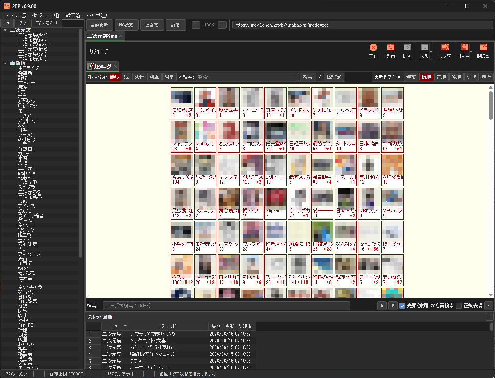
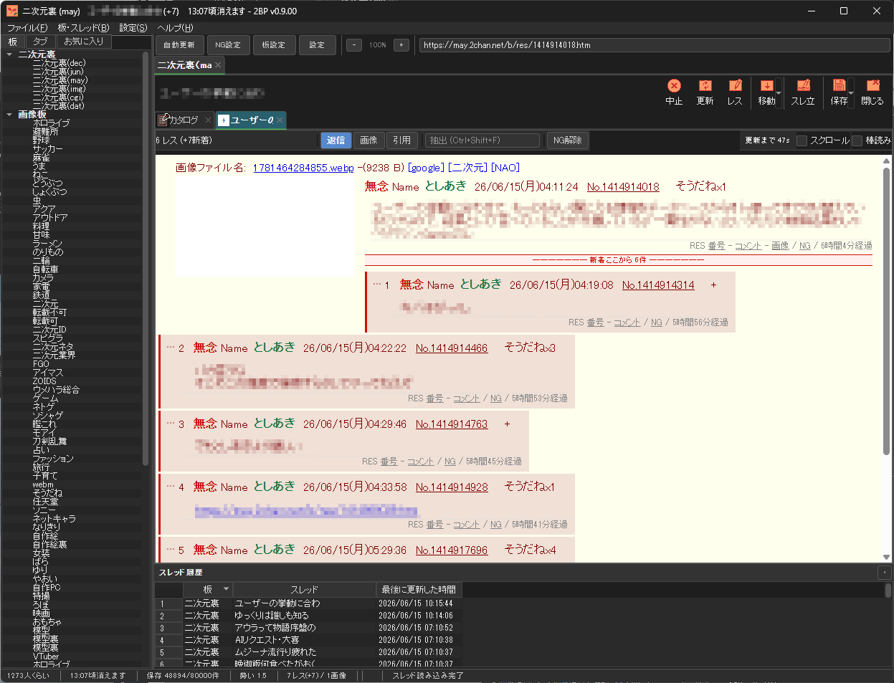

# 2BP (futaba2b python版)

ふたば☆ちゃんねる（2chan.net）専用ブラウザ — PySide6 / QtWebEngine 製のデスクトップアプリケーションです。


> **注意**: 本ソフトウェアは非公式のサードパーティ製ブラウザです。ふたば☆ちゃんねる運営とは関係ありません。利用は自己責任でお願いします。サーバーに過度な負荷をかけない設定でご利用ください。

---

## スクリーンショット

   　
---

## 目次

- [主な機能](#主な機能)
- [動作環境](#動作環境)
- [インストール（初めての方向け）](#インストール初めての方向け)
- [起動方法](#起動方法)
- [アップデート方法](#アップデート方法)
- [ファイル構成](#ファイル構成)
- [設定・データの保存場所](#設定データの保存場所)
- [使用している音声について（ライセンス表記）](#使用している音声について（ライセンス表記）)
- [ライセンス](#ライセンス)
- [免責事項](#免責事項)

---

## 主な機能

- **カタログ / スレッド表示** — タブブラウザ形式。中クリックでバックグラウンドタブ、右クリックメニュー、ホバーポップアップ対応
- **自動更新** — 段階的更新間隔（残り保存件数の%に応じて 100/50/25/10/5/1% の6段階・秒単位で設定可能）、スレ落ち検知時の自動保存
- **NG機能** — NGワード / NG画像 / 逆NG（キーワードに一致したスレを自動で開く）/ 置換 / 芝刈り。適用範囲（本文・名前・メール・件名・ID・IP・カタログ）を個別指定可能
- **ログ保存** — HTML / MHT / ZIP / スクリーンショット(PNG・長スレ自動分割) 形式。サムネイル非保存（本画像URL差し替え）オプション
- **画像ビューア** — 画像タブ（フィット⇔等倍トグル・ドラッグパン）、動画再生（mp4/webm）、フォルダ保存、最近開いた画像
- **投稿** — 返信・スレ立て、クリップボード画像貼付け（JPEG品質指定）、サンプルプレビュー
- **そうだね対応** — JSON diff API による正確なそうだね数表示
- **棒読みちゃん連携** — 新着レスの読み上げ（HTTP連携）
- **カスタマイズ** — テーマ（dark / light / dark_pink / light_pink）、キーボードショートカット設定、板別設定

---

## 動作環境

- Windows 10 / 11 (64bit)
- Python 3.10 以上

> Python の知識が無くても、下記の手順どおりに進めれば動作します。

---

## インストール（初めての方向け）

ここでは「パソコンに 2BP を初めて入れる」想定で、ひとつずつ説明します。

### 1. Python をインストールする

2BP は Python というプログラミング言語の実行環境の上で動作します。すでに Python 3.10 以上が入っている場合はこの手順は不要です。

1. 以下のページを開きます。
   👉 https://www.python.org/downloads/
2. 「Download Python 3.x.x」のボタンからインストーラーをダウンロードします。
3. インストーラーを実行する際、**画面下部の「Add python.exe to PATH」（または「Add Python to PATH」）に必ずチェックを入れてください**。
   これを忘れると `python` コマンドが使えず、2BP が起動できません。
4. 「Install Now」でインストールを進めます。
5. インストール後、確認のため コマンドプロンプト（Windowsキー → `cmd` と入力 → Enter）を開き、次のコマンドを実行します。

   ```bat
   python --version
   ```

   `Python 3.10.x` のようにバージョンが表示されれば成功です。

### 2. 2BP をダウンロードする

GitHub のページ右上にある緑色の「**Code**」ボタン →「**Download ZIP**」を選び、ZIP ファイルをダウンロードします。
ダウンロードした ZIP を、好きな場所（例: デスクトップ）に展開（解凍）してください。展開後のフォルダの中に `futaba2b_app_qt.py` などのファイルが並んでいれば OK です。

> Git を使える方は、以下のコマンドでも取得できます。
>
> ```bash
> git clone https://github.com/<あなたのユーザー名>/futaba2b.git
> ```

### 3. 必要なライブラリをインストールする（`setup_2bp.bat`）

2BP のフォルダの中にある **`setup_2bp.bat`** を**ダブルクリック**してください。
これだけで、2BP の動作に必要な Python のライブラリが自動でインストールされます。

黒い画面（コマンドプロンプト）が開き、以下のような処理が行われます。

- Python が使える状態かを確認
- `pip`（ライブラリ管理ツール）を最新版に更新
- `requirements.txt` に書かれているライブラリをまとめてインストール

「Setup complete!」と表示されれば準備完了です。何か `[ERROR]` が表示された場合は、インターネット接続を確認するか、手順1の Python インストールをやり直してみてください。

> 手動でインストールしたい場合は、2BP のフォルダで以下のコマンドでも同じことができます。
>
> ```bash
> pip install -r requirements.txt
> ```

#### 2BP が使っている主なライブラリ（`import` するもの）について

`requirements.txt` に記載されている各ライブラリの役割は以下のとおりです。詳しい知識は不要ですが、「何のために入れているのか」を知りたい方向けの説明です。

| ライブラリ | バージョン | 役割 |
|---|---|---|
| **PySide6** | 6.6 以上 | アプリのウィンドウや画面（GUI）、およびブラウザ表示部分（QtWebEngine）を作るためのライブラリです。2BP の見た目・操作はすべてこれで動いています。 |
| **requests** | 2.31 以上 | スレッドの取得・投稿・画像のダウンロードなど、インターネット通信全般に使います。 |
| **beautifulsoup4** | 4.12 以上 | ふたばのページの HTML を解析して、レス本文やスレ情報を取り出すために使います。 |
| **lxml** | 5.0 以上 | beautifulsoup4 が HTML を解析するときの高速な処理エンジンです。 |
| **Pillow** | 10.0 以上 | 画像のリサイズや形式変換（投稿時のクリップボード画像処理など）に使います。 |
| **psutil** | 5.9 以上 | 多重起動の防止など、PC上のプロセス（実行中のプログラム）情報を扱うために使います。 |

これらは `setup_2bp.bat` を実行すれば自動でインストールされるため、通常は内容を覚える必要はありません。

---

## 起動方法

フォルダ内のバッチファイルをダブルクリックするだけで起動できます。

| ファイル | 説明 |
|---|---|
| **`run_2bp.bat`** | 通常の起動用です。基本的にはこちらを使ってください。 |
| **`run_2bp_loop.bat`** | 自動再起動付きの起動用です。万が一クラッシュした場合に、自動で再起動しながら使い続けたい場合に使用してください。 |

初回起動時に `python` が見つからない、または起動に失敗する場合は、`setup_2bp.bat` を実行してから再度お試しください。

---

## アップデート方法

開発者から新しいバージョンの ZIP（`files.zip` など）が配布された場合は、`update.bat` を使うと、現在のファイルをバックアップしつつ新しいファイルだけを上書きできます。
（設定ファイルやログなどの個人データは上書きされません。）

通常の利用では、GitHub から最新版を再ダウンロードして `futaba2b_*.py` を上書きするだけでも更新できます。

---

## ファイル構成

| ファイル | 役割 |
|---|---|
| `futaba2b_qt.py` | エントリポイント（`python futaba2b_qt.py` で起動） |
| `futaba2b_main_window.py` | メインウィンドウ・ログ保存・タブ復元 |
| `futaba2b_app_qt.py` | 板ペイン・スレッドビュー・画像タブ・自動更新 |
| `futaba2b_dialogs.py` | 各種ダイアログ（投稿・NG設定・アプリ設定・板設定） |
| `futaba2b_html.py` | スレッド/カタログ HTML レンダリング |
| `futaba2b_network.py` | 通信・HTML パース（ふたば API 対応） |
| `futaba2b_settings.py` | 設定の永続化・NGフィルタ |
| `futaba2b_bridge.py` | QWebChannel（JS ↔ Python ブリッジ） |
| `futaba2b_models.py` | データモデル |
| `futaba2b_const.py` | 定数・テーマ管理 |
| `setup_2bp.bat` | 初回セットアップ用（必要なライブラリのインストール） |
| `run_2bp.bat` | 通常起動用 |
| `run_2bp_loop.bat` | 自動再起動付き起動用 |
| `theme/` | テーマ JSON・効果音 |

---

## 設定・データの保存場所

設定ファイル・キャッシュ・ログ（`futaba2b_settings.json` など）は、2BP の実行フォルダ内に自動生成されます。これらは個人データのためリポジトリには含まれません（`.gitignore` で除外済み）。

---

## 使用している音声について（ライセンス表記）

2BP では、NG設定に一致したレスを検知した際の通知効果音（`theme/ng_se.wav`）の音声生成に **Irodori-TTS**（Aratako 氏作）を利用しています。

> 本作品の音声制作には Irodori-TTS を使用しています。
> Irodori-TTS: MIT License / Copyright (c) Aratako

Irodori-TTS（v3系・MIT License）は、生成した音声の利用にあたって特別な許諾・クレジット表記は必須ではありませんが、敬意を表してここに記載しています。
なお、初代バージョン（Aratako/Irodori-TTS-500M）は CC-BY-NC 4.0（非商用限定）で公開されているため、別バージョンで音声を生成する場合は、利用するモデルのライセンスを別途ご確認ください。

---

## ライセンス

[MIT License](LICENSE)

---

## 免責事項

本ソフトウェアは非公式のサードパーティ製ブラウザです。ふたば☆ちゃんねる運営とは関係ありません。利用は自己責任でお願いします。サーバーに過度な負荷をかけない設定でご利用ください。
---

## 対応するのは大変なので対応予定なし
・アクションスクリプト


